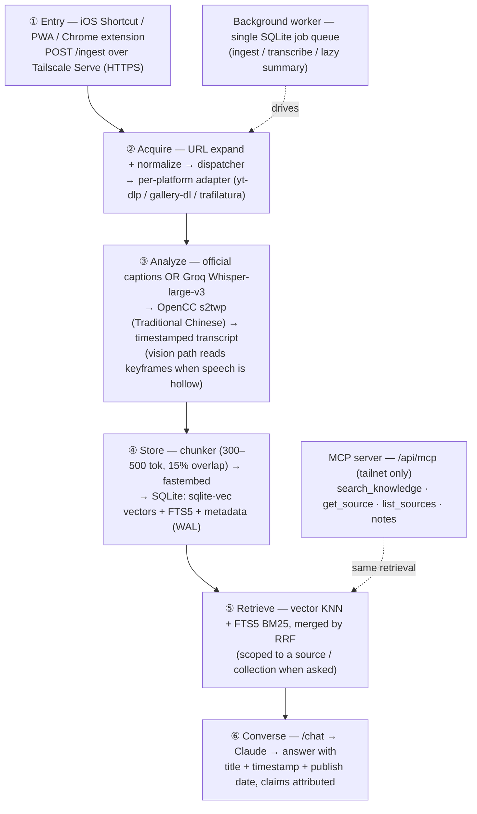

# vidrag — a personal RAG knowledge base for social videos

Share a video link from your phone; the system fetches it, transcribes it,
chunks and embeds it into SQLite, and lets you query the whole library in
natural language from a chat PWA — with every answer citing its source's
**title + timestamp + publish date**.

> **This is a personal, self-hosted tool, not a hosted service.** It runs on a
> single Raspberry Pi behind a private Tailscale network. The *code* is open
> for others to read and learn from; running your own instance is on you.
> See [Scope & honesty](#scope--honesty).

---

## Why it might be worth your time

Most "another RAG" repos have no numbers. This one is built around measurement:

- **Hybrid retrieval that's actually measured.** Vector KNN (fastembed / ONNX,
  no PyTorch) fused with FTS5 BM25 via Reciprocal Rank Fusion. A fully offline,
  zero-API-cost eval harness reports recall@k, MRR, and a **per-path attribution
  table** ("did the vector path or the keyword path find this chunk?"). When a
  regression showed up, the harness *drove the fix* — see [Retrieval eval](#retrieval-eval-offline-zero-cost).
- **Answer quality as a rubric, not a vibe.** The product's own trust rules
  (attribute every claim to its source, never state it as fact; carry the
  citation triple; refuse when the library has nothing) are turned into an
  **LLM-as-judge eval**. Numbers below.
- **Retrieval tracing.** Every answer stores *which* chunks fed it and *how*
  each was retrieved (vector rank + distance / FTS rank). The PWA surfaces this
  as a "why this answer" panel, so a wrong answer can be attributed to
  retrieval vs. generation — by looking at a screen, not opening a terminal.
- **An MCP server.** The same hybrid search is exposed over Model Context
  Protocol (streamable-HTTP JSON-RPC) so a desktop LLM client can query the
  library directly, over the private tailnet only.
- **A vision fallback for slide-heavy / low-speech videos.** A decision chain
  (official captions → speech-coverage check → keyframe pre-judge) decides
  when to read the *frames* instead of the audio, so charts and on-screen text
  get indexed too.
- **Zero-CLI operations.** After first install, everything — yt-dlp updates,
  cookie refresh, backups, health checks — is done from the PWA admin page.

Built with a hard rule that transcripts are **untrusted input**: they're framed
as data in every prompt and escaped at every DOM sink (prompt-injection and
stored-XSS are treated as real threats, not hypotheticals).

---

## Architecture — a six-layer pipeline



**Why SQLite and not a vector database?** For a single-user library of a few
thousand chunks, sqlite-vec + FTS5 in one `.db` file gives vector search, exact
keyword search, and all metadata with **zero extra services** to run, back up,
or keep alive on a 4 GB Pi. The whole system's portable unit is `data/` +
`docker-compose.yml`; disaster recovery is "restore two things." Adding Qdrant
or Redis would buy scale this workload will never need and cost operational
surface it can't afford — a deliberate YAGNI call, documented as such.

Other decisions in the same spirit: full **Whisper-large-v3** (not turbo) because
a transcription error permanently pollutes the RAG — ingest accuracy outranks
speed and cost; **hybrid** retrieval because tickers and proper nouns (2330,
CoWoS) need exact BM25 matching that dense vectors are weak at, while paraphrased
questions need the vectors — each path covers the other's blind spot.

---

## Evaluation

### Retrieval eval (offline, zero-cost)

Fixed fixture corpus + golden query set. Runs the **real** ingest pipeline into
a temp DB and the **real** hybrid `retrieve()`; local fastembed, no API key, no
cost. `BAAI/bge-small-zh-v1.5`, RRF_K=60, max vector distance 1.0, k=5:

| Version | recall@5 | MRR | proper-noun recall | negative false-hits (of 4) |
|---|---|---|---|---|
| initial | 0.97 | 0.95 | 0.86 | 1 |
| **after `_fts_query` fix** | **1.00** | **0.98** | **1.00** | 1 (unchanged) |

The harness caught a real miss on first run (a Chinese question collapsed into a
single un-matchable FTS phrase while its correct vector neighbor sat just past
the distance threshold). A threshold **sweep proved that loosening the cutoff
was the wrong fix** — it recovered the miss but turned all four negative queries
into noise (false-hits 1→4), which would violate the honest-attribution rule.
The right fix was cheap: strip interrogative/filler tokens from the FTS query so
long Chinese questions don't degenerate into one phrase term. Measure → reject
the tempting fix → find the zero-cost correct one.

### Answer-quality eval (LLM-as-judge)

Runs each golden question through the **full RAG chain**, then a Haiku judge
scores it against the product's own rules (faithfulness to sources; citation
triple present; claims attributed as "the author says", not stated as fact);
"should-refuse" questions are checked for non-fabrication. First baseline
(budget/Haiku answers, 7 questions + 1 refusal):

| Metric | Score | Note |
|---|---|---|
| attribution | **7/7** | the system-prompt attribution rule holds |
| faithfulness | **5/7** | budget Haiku drifts occasionally; Sonnet expected higher |
| citation triple | **0/7** | *fixture artifact* — the corpus is all text-type sources (no timestamps / real publish dates), so the judge correctly flags the triple as incomplete. A video-type fixture is needed to measure this meaningfully. |
| refusal | **1/1** | correctly answers "not in the library" instead of guessing |

The 0/7 is kept visible on purpose: it's an honest fixture limitation, not a
hidden failure. Full write-up in [`scripts/eval_corpus/README.md`](scripts/eval_corpus/README.md).

---

## Tech stack

- **Backend:** Python, FastAPI, a single background worker over a SQLite job queue
- **Storage:** SQLite (WAL) + [sqlite-vec](https://github.com/asg017/sqlite-vec) + FTS5 (trigram tokenizer for Chinese)
- **Embeddings:** [fastembed](https://github.com/qdrant/fastembed) (ONNX) — `bge-small-zh-v1.5`
- **Transcription:** Groq Whisper-large-v3; OpenCC (`s2twp`) for Simplified→Taiwan-Traditional
- **Ingest:** yt-dlp, gallery-dl, trafilatura (+ optional cloud-render fallback for JS pages)
- **LLM:** Claude (Sonnet for chat/vision, Haiku for mechanical display tasks)
- **Frontend:** vanilla-JS PWA — no framework, no build step
- **Interop:** an MCP server exposing the library to desktop LLM clients
- **Deploy:** Docker Compose on a Raspberry Pi 4, private via Tailscale Serve

---

## Running it (sketch)

The portable unit is `data/` + `docker-compose.yml`.

```bash
cp .env.example data/.env          # fill in GROQ_API_KEY, ANTHROPIC_API_KEY, APP_TOKEN
docker compose up -d --build       # first run also does preflight checks
```

Then open the PWA (behind your own Tailscale Serve HTTPS endpoint) and follow
the in-app admin page. There is intentionally no public port. This repo is
shared to be read; it is not packaged for turnkey third-party deployment.

---

## Scope & honesty

- **Personal use only.** vidrag is a single-user tool for privately re-reading
  content *you* chose to save. It is not, and won't become, a hosted service.
- **Extraction vs. Terms of Service.** Where official APIs/captions aren't
  available, the ingest path falls back to extraction tools (yt-dlp, gallery-dl).
  That can conflict with a platform's ToS, which is exactly why this is confined
  to personal use and not offered as a deployment. Private/removed content can't
  be recovered — fetching at share-time is the only preservation.
- **Open code ≠ open service.** Publishing the *source* doesn't contradict the
  personal-use stance: what's shared is a program to study, not a running
  service to sign up for.
- **Known limits (accepted, not bugs):** some Instagram content needs a login
  cookie that expires; yt-dlp's IG/TikTok support drifts with platform changes;
  iOS has no Web Share Target, so sharing is a two-step "share → shortcut".

---

## License

[MIT](LICENSE).
